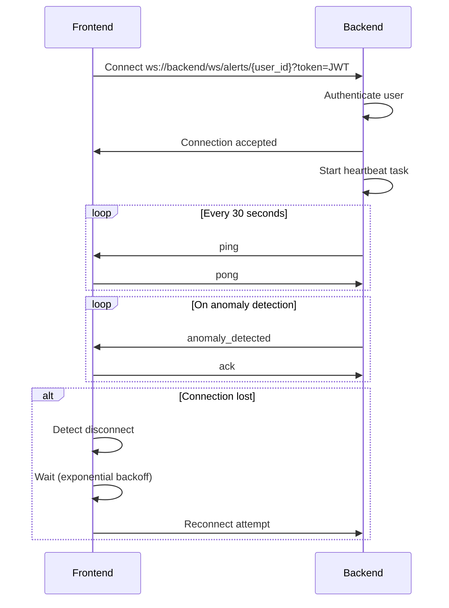

# Persistent WebSocket Connection Implementation

This document describes the persistent WebSocket connection architecture between the VisionGuard AI frontend and backend.

## Overview

The system implements a robust, persistent WebSocket connection that maintains connectivity between the frontend and backend for real-time anomaly alerts. The connection includes automatic reconnection, heartbeat monitoring, and exponential backoff strategies.

## Architecture

### Backend (`app/api/websocket.py`)

#### WebSocketManager Class

The `WebSocketManager` class handles all WebSocket connections with the following features:

**Connection Management:**
- One WebSocket connection per user
- Tracks connection timestamps
- Monitors heartbeat activity
- Automatic cleanup on disconnection

**Heartbeat Mechanism:**
- Server sends `ping` messages every 30 seconds
- Expects `pong` response from client
- Tracks last heartbeat timestamp per connection
- Connection is considered stale if no response for 60 seconds

**Connection Tracking:**
```python
self.connections: Dict[str, WebSocket]        # Active connections by user_id
self.connection_times: Dict[str, datetime]    # Connection start times
self.last_heartbeat: Dict[str, datetime]      # Last heartbeat received
```

#### WebSocket Endpoint

**Endpoint:** `ws://localhost:8000/ws/alerts/{user_id}?token=JWT_TOKEN`

**Authentication:**
- Requires valid JWT token as query parameter
- Verifies user identity matches token
- Validates user exists in database

**Message Types:**

| Type | Direction | Description |
|------|-----------|-------------|
| `ping` | Bidirectional | Heartbeat check |
| `pong` | Bidirectional | Heartbeat response |
| `anomaly_detected` | Server → Client | Anomaly detection alert |
| `ack` | Client → Server | Acknowledgment of alert |

**Connection Lifecycle:**
1. Client connects with JWT token
2. Server authenticates and accepts connection
3. Server starts heartbeat task (ping every 30s)
4. Connection stays open indefinitely
5. On disconnect: cleanup connection state

#### Monitoring Endpoints

**Get All Connections:**
```
GET /ws/connections
```
Returns statistics for all active WebSocket connections.

**Get User Connection:**
```
GET /ws/connections/{user_id}
```
Returns connection status for a specific user, including:
- Connection status
- Connected timestamp
- Uptime in seconds
- Last heartbeat timestamp
- Seconds since last heartbeat

### Frontend (`hooks/useAnomalyAlerts.ts`)

#### Connection Features

**Automatic Reconnection:**
- Exponential backoff strategy
- Initial delay: 1 second
- Max delay: 30 seconds
- Backoff multiplier: 1.5x per attempt

**Heartbeat Monitoring:**
- Sends `ping` to server every 30 seconds
- Expects `pong` response within 60 seconds
- Automatically closes and reconnects if no response

**Connection State:**
```typescript
connected: boolean           // Current connection status
reconnectAttempts: number    // Number of reconnection attempts
reconnectDelay: number       // Current reconnection delay
lastHeartbeat: number        // Timestamp of last heartbeat
```

#### Message Handling

**Outgoing Messages:**
- `ping`: Heartbeat check to server
- `pong`: Response to server ping
- `ack`: Acknowledgment of anomaly alert

**Incoming Messages:**
- `ping`: Server heartbeat check (respond with pong)
- `pong`: Server heartbeat response
- `anomaly_detected`: Real-time anomaly alert with frame data

## Connection Flow



## Configuration

### Backend Configuration

**Heartbeat Settings:**
```python
PING_INTERVAL = 30      # Send ping every 30 seconds
HEARTBEAT_TIMEOUT = 60  # Close if no response for 60 seconds
```

### Frontend Configuration

**Reconnection Settings:**
```typescript
INITIAL_RECONNECT_DELAY = 1000     // 1 second
MAX_RECONNECT_DELAY = 30000        // 30 seconds
HEARTBEAT_INTERVAL = 30000         // 30 seconds
HEARTBEAT_TIMEOUT = 60000          // 60 seconds
```

**Environment Variables:**
```bash
NEXT_PUBLIC_WS_URL=ws://localhost:8000  # WebSocket server URL
```

## Usage

### Frontend Integration

```typescript
import { useAnomalyAlerts } from '@/hooks/useAnomalyAlerts'

function MyComponent() {
  const { alerts, connected, clearAlerts, removeAlert } = useAnomalyAlerts()
  
  return (
    <div>
      <p>Status: {connected ? 'Connected' : 'Disconnected'}</p>
      <ul>
        {alerts.map(alert => (
          <li key={alert.id}>
            Person #{alert.person_id} - {alert.details.status}
          </li>
        ))}
      </ul>
    </div>
  )
}
```

### Backend Usage

```python
from app.api.websocket import get_websocket_manager

ws_manager = get_websocket_manager()

# Send alert to user
await ws_manager.send_anomaly_alert(
    user_id="user_123",
    stream_id="stream_456",
    detection_result={
        "person_id": 1,
        "status": "shoplifting_detected",
        "confidence": 0.95
    },
    annotated_frame=frame_np
)
```

## Monitoring

### Check Connection Status

**All Connections:**
```bash
curl http://localhost:8000/ws/connections
```

**Specific User:**
```bash
curl http://localhost:8000/ws/connections/{user_id}
```

**Response Example:**
```json
{
  "total_connections": 3,
  "connections": [
    {
      "user_id": "123e4567-e89b-12d3-a456-426614174000",
      "connected": true,
      "connected_at": "2024-12-03T10:30:00",
      "uptime_seconds": 3600,
      "last_heartbeat": "2024-12-03T11:29:30",
      "seconds_since_heartbeat": 30
    }
  ]
}
```

## Troubleshooting

### Connection Keeps Dropping

**Check heartbeat intervals:**
- Ensure frontend and backend heartbeat intervals match
- Verify network allows WebSocket connections
- Check for proxy/firewall interference

**Solution:**
1. Review browser console for WebSocket errors
2. Check backend logs for disconnection reasons
3. Verify JWT token is valid and not expired

### Reconnection Loop

**Symptom:** Frontend continuously reconnects

**Possible Causes:**
- Invalid JWT token
- User not found in database
- Backend WebSocket endpoint not accessible

**Solution:**
1. Verify authentication token is valid
2. Check backend logs for authentication errors
3. Ensure user exists in database

### High Latency

**Check network conditions:**
```bash
# Test WebSocket connection
wscat -c ws://localhost:8000/ws/alerts/{user_id}?token={token}
```

**Monitor connection stats:**
```bash
# Check heartbeat timing
curl http://localhost:8000/ws/connections/{user_id}
```

## Best Practices

1. **Always authenticate:** Never skip JWT token validation
2. **Handle reconnection gracefully:** Use exponential backoff
3. **Monitor heartbeats:** Track connection health
4. **Log connection events:** Debug issues quickly
5. **Cleanup resources:** Close connections properly on component unmount
6. **Handle errors:** Catch and log WebSocket errors
7. **Test reconnection:** Simulate network failures

## Security Considerations

1. **JWT Authentication:** All connections require valid JWT token
2. **User Verification:** User ID must match token claims
3. **Connection Isolation:** Each user has separate WebSocket connection
4. **Automatic Cleanup:** Stale connections are removed
5. **Rate Limiting:** Consider implementing connection rate limits

## Performance

**Connection Limits:**
- No hard limit on number of concurrent connections
- Each connection maintains minimal memory overhead
- Heartbeat tasks use async/await for efficiency

**Scalability:**
- Horizontal scaling requires sticky sessions or Redis pub/sub
- Consider WebSocket load balancer for production
- Monitor connection count and resource usage

## Future Enhancements

- [ ] Redis pub/sub for multi-server deployments
- [ ] Connection metrics and analytics
- [ ] Configurable heartbeat intervals
- [ ] Connection compression
- [ ] Binary message support for larger payloads
- [ ] Connection pooling and load balancing
- [ ] Automatic token refresh before expiration

## References

- [FastAPI WebSockets](https://fastapi.tiangolo.com/advanced/websockets/)
- [MDN WebSocket API](https://developer.mozilla.org/en-US/docs/Web/API/WebSocket)
- [RFC 6455 - The WebSocket Protocol](https://tools.ietf.org/html/rfc6455)
